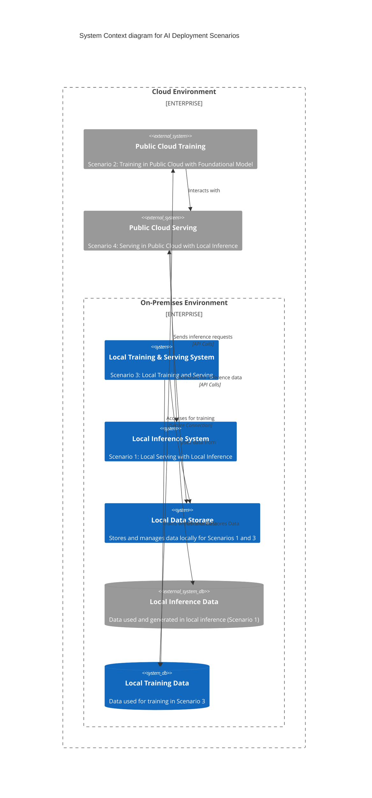
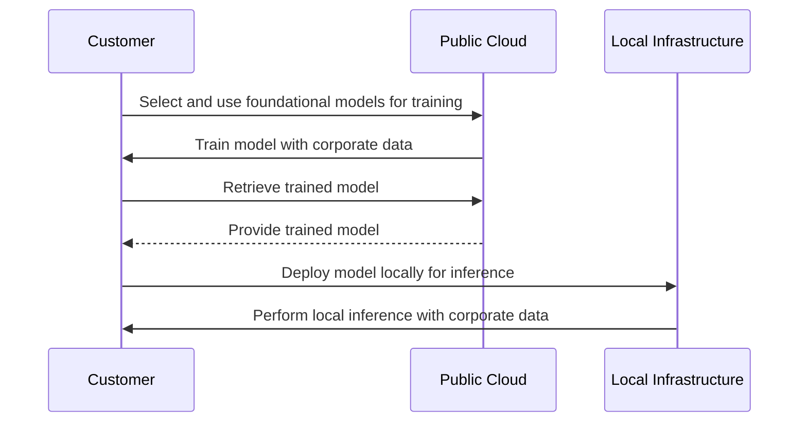
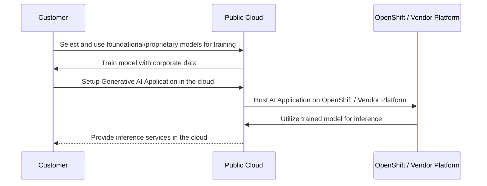

# model-deployment-scenarios

## Two Differnent Points of View

### Table 1: Perspectives on Training Application vs. Generative AI Application

| Aspect                       | Training Application                                                                                          | Generative AI Application                                                                 |
|------------------------------|--------------------------------------------------------------------------------------------------------------|--------------------------------------------------------------------------------------------|
| **Model Development and Testing** | Involves creating, iterating, and validating AI models. Can occur in public cloud (Scenario 2) or locally (Scenario 3). | Not directly involved, as this phase precedes the generative AI application deployment.     |
| **Performance Lifecycle Management** | Continuous monitoring and updating of models to maintain performance. Relevant in both cloud and local scenarios. | Relies on well-maintained models for optimal performance but is not directly involved in this process. |
| **Drift Detection**          | Essential for ongoing model maintenance to ensure model accuracy over time.                                   | Depends on the training application to detect and correct drift for sustained accuracy in inference. |

### Table 2: Locality of Operations in AI Deployment Scenarios

| Scenario                     | Description                                                                                                   | Locality                                                                                                                                                        |
|------------------------------|---------------------------------------------------------------------------------------------------------------|-----------------------------------------------------------------------------------------------------------------------------------------------------------------|
| **Scenario 1**               | Local Serving with Local Inference                                                                            | Entire process occurs on customer's premises. Offers high data privacy and low latency.                                                                         |
| **Scenario 2**               | Training in Public Cloud with Foundational Model                                                              | Training occurs in the public cloud, leveraging cloud resources for model development and iteration.                                                           |
| **Scenario 3**               | Local Training and Serving                                                                                    | Similar to Scenario 2, but all activities, including training and serving, happen locally at the customer's premises.                                           |
| **Scenario 4**               | Serving in Public Cloud with Local Inference                                                                  | AI model is served from the public cloud, but inference occurs locally at the customer's premises. Balances cloud capabilities with local data processing. |

## Simple Design

## Detailed Design

### Public Cloud is Wrapped around Premise becuase of VPC Assumptions

## Written Description of Model Consumption "Use Cases"

- These are model focused use cases, not high level business value use cases.

### Use Case 1: Model Training in the Cloud and Deployment Options

#### **Use Case 1A: Local Deployment of Open Source Model for Inference**

In this scenario, the customer focuses on leveraging public cloud resources for training their AI model. The steps include:

1. **Choosing a Public Cloud Vendor:**
   - The customer selects their preferred cloud provider.
   - They explore various foundational models available for training.

2. **Training with Corporate Data:**
   - The customer moves their corporate data to the cloud.
   - They use this data to train the model, potentially an open-source model.

3. **Local Deployment for Inference:**
   - After training, the customer takes the model off-premise for local deployment.
   - This model is used for inference on the customer's premises.
   - The customer might use a standalone generative AI application, either developed in-house or provided by a vendor, to utilize the model.

#### **Use Case 1B: Cloud-based Deployment with Proprietary Development**

In this variation, the focus is on utilizing cloud-native resources extensively, especially when dealing with proprietary or highly integrated cloud models.

1. **Cloud-based Model Training with Proprietary Elements:**
   - The model training still happens in the public cloud, similar to Use Case 1A.
   - However, the model may involve proprietary elements or extensive fine-tuning, making it less portable.

2. **Dependence on Cloud for Inference:**
   - The trained model remains in the cloud, primarily due to its complexity or proprietary nature.
   - This model could be a sophisticated one, integrating more deeply with cloud services.

3. **Generative AI Application in the Cloud:**
   - The generative AI application, designed to leverage the trained model, is also deployed in the cloud.
   - Platforms like Redhat OpenShift offer marketplace options for deploying these applications in various public clouds.
   - Both the application and inference processes are cloud-based, making use of the cloud's foundational models or the custom-tuned models with corporate data.

In both Use Case 1A and 1B, the primary distinction lies in where the inference occurs and how the model is managed post-training—locally in 1A with potential open-source models, or entirely in the cloud in 1B with proprietary or more complex models. This decision impacts the flexibility, data sovereignty, and integration with other cloud services for the customer.

## Why Use Case 1B?

### Strategic Value in Use Case 1B: Embracing Public Cloud Ecosystem and Multi/Hybrid Cloud Environments

#### **Leveraging the Public Cloud Ecosystem**

Use Case 1B strategically emphasizes utilizing the rich ecosystem of services available in the public cloud. The rationale includes:

1. **Access to Advanced Services:**
   - The customer benefits from a wide array of services around training and inference exclusive to the public cloud.
   - These services enhance the AI model's capabilities, offering advanced functionalities that may not be readily available or feasible in a local environment.

2. **Governance and Privacy Confidence:**
   - Customers have confidence in the governance and privacy measures implemented in public clouds.
   - This trust is crucial for handling sensitive corporate data during training and inference processes.

3. **Financially Advantageous:**
   - The arrangement with the public cloud provider is financially favorable.
   - It offers a cost-effective solution for the customer while being profitable for the cloud provider.

#### **Red Hat OpenShift's Role in Enhancing Use Case 1B**

Red Hat OpenShift provides a significant advantage in this scenario by:

1. **Bridging Multi and Hybrid Cloud Environments:**
   - OpenShift allows for seamless integration across multiple cloud environments.
   - This flexibility is vital for organizations that operate in multi-cloud or hybrid cloud settings.

2. **Facilitating Open Source Integration:**
   - OpenShift's compatibility with various open source tools and software enhances the customer's ability to operate in diverse cloud contexts.
   - This open source integration empowers customers to customize and extend their cloud capabilities.

3. **Enhancing Service Extension:**
   - Customers can extend unique services to other clouds or back to their premises using open source technologies.
   - OpenShift offers a streamlined and efficient way to enhance and personalize the customer's cloud experience.

In summary, Use Case 1B strategically positions the customer to take full advantage of the public API ecosystem. This approach is supported by the confidence in cloud governance and privacy, financially advantageous arrangements, and the utilization of Red Hat OpenShift to bridge and enhance operations across multi and hybrid cloud environments. The customer thus gains a versatile, powerful, and customizable AI and cloud solution and on-premise solutions for non model serving and trainging workloads. 

## Why Use Case 1A?

### Use Case 1A: Strategic Approach for Local Inference with Public Cloud Training

In Use Case 1A, the customer's strategy is shaped by the desire to balance the benefits of public cloud resources with the control and security of local inference. Here’s how this strategy unfolds:

#### **Utilizing Public Cloud for Training**

1. **Cost-Effective Model Development:**
   - The public cloud is seen as a cost-efficient environment for training AI models, especially when avoiding upfront capital investment in GPUs and other infrastructure.
   - It's ideal for testing solutions and gauging their potential to generate revenue or reduce expenses.

2. **Faster Time-to-Market:**
   - By leveraging cloud resources, the customer can quickly test the viability of AI solutions.
   - This approach accelerates the process from concept to testing, ensuring a swift market response.

#### **Local Deployment for Inference and Integration**

1. **Integration with Corporate Data:**
   - Post-training, the model is brought on-premise to be integrated with specific, live corporate data.
   - This allows for a more tailored application of the model to real-life corporate scenarios, distinct from the training data.

2. **Enhanced Governance and Security:**
   - The on-premise deployment of the model for inference aligns with the customer's focus on data governance, security, and privacy.
   - This approach offers greater control over the model and the data it interacts with.

3. **Serving Internal and External Customers:**
   - The model's inference capabilities are utilized to serve internal employees or to enhance products offered to external customers.
   - Local inference supports the provision of specialized AI services with a focus on customer expectations and security.

#### **Emphasis on Open Source Models and Vendor Selection**

1. **Open Source Model Preference:**
   - The strategy demands the use of open-source models that can be trained in the cloud and then transferred locally for inference.
   - This choice facilitates ease of transfer and alignment with the company's governance standards.

2. **Choosing the Right Public Cloud Partner:**
   - The customer must select a public cloud provider that supports this open-source approach.
   - The choice of vendor is crucial, as it needs to align with the company’s strategy of training in the cloud and deploying locally.

In summary, Use Case 1A represents a strategic blend of leveraging cloud capabilities for training and local resources for inference. This approach is driven by the need for cost efficiency, faster time-to-market, enhanced data security, and control over the AI models, particularly in rapidly evolving business environments. The focus on open-source models and careful selection of cloud vendors underpins this strategy, ensuring alignment with the company's overall objectives and governance policies.

## Sequence Diagrams

**Sequence Diagram for Use Case 1A: Local Inference with Public Cloud Training**

**Sequence Diagram for Use Case 1B: Public Cloud for Training and Inference**

