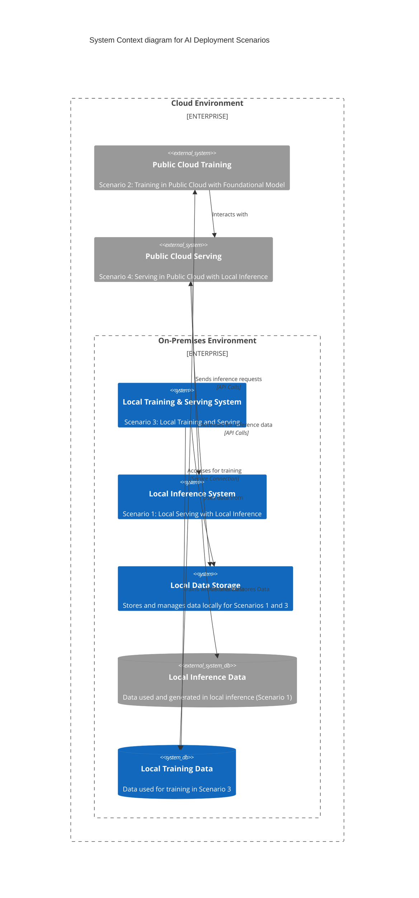

# model-deployment-scenarios

## Two Differnent Points of View

### Table 1: Perspectives on Training Application vs. Generative AI Application

| Aspect                       | Training Application                                                                                          | Generative AI Application                                                                 |
|------------------------------|--------------------------------------------------------------------------------------------------------------|--------------------------------------------------------------------------------------------|
| **Model Development and Testing** | Involves creating, iterating, and validating AI models. Can occur in public cloud (Scenario 2) or locally (Scenario 3). | Not directly involved, as this phase precedes the generative AI application deployment.     |
| **Performance Lifecycle Management** | Continuous monitoring and updating of models to maintain performance. Relevant in both cloud and local scenarios. | Relies on well-maintained models for optimal performance but is not directly involved in this process. |
| **Drift Detection**          | Essential for ongoing model maintenance to ensure model accuracy over time.                                   | Depends on the training application to detect and correct drift for sustained accuracy in inference. |

### Table 2: Locality of Operations in AI Deployment Scenarios

| Scenario                     | Description                                                                                                   | Locality                                                                                                                                                        |
|------------------------------|---------------------------------------------------------------------------------------------------------------|-----------------------------------------------------------------------------------------------------------------------------------------------------------------|
| **Scenario 1**               | Local Serving with Local Inference                                                                            | Entire process occurs on customer's premises. Offers high data privacy and low latency.                                                                         |
| **Scenario 2**               | Training in Public Cloud with Foundational Model                                                              | Training occurs in the public cloud, leveraging cloud resources for model development and iteration.                                                           |
| **Scenario 3**               | Local Training and Serving                                                                                    | Similar to Scenario 2, but all activities, including training and serving, happen locally at the customer's premises.                                           |
| **Scenario 4**               | Serving in Public Cloud with Local Inference                                                                  | AI model is served from the public cloud, but inference occurs locally at the customer's premises. Balances cloud capabilities with local data processing. |

## Simple Design

```mermaid
graph TD
    subgraph Scenario 1 [Scenario 1: Local Serving with Local Inference]
        S1_Training[Training: Not Specified]
        S1_Serving[Serving: Local]
        S1_Inference[Inference: Local]
        S1_Data[Data Location: Local]
        S1_Training --> S1_Serving
        S1_Serving --> S1_Inference
        S1_Inference --> S1_Data
    end

    subgraph Scenario 2 [Scenario 2: Training in Public Cloud with Foundational Model]
        S2_Training[Training: Public Cloud]
        S2_Serving[Serving: Not Specified]
        S2_Inference[Inference: Not Specified]
        S2_Data[Data Location: Public Cloud]
        S2_Training --> S2_Serving
        S2_Serving --> S2_Inference
        S2_Inference --> S2_Data
    end

    subgraph Scenario 3 [Scenario 3: Local Training and Serving]
        S3_Training[Training: Local]
        S3_Serving[Serving: Local]
        S3_Inference[Inference: Local]
        S3_Data[Data Location: Local]
        S3_Training --> S3_Serving
        S3_Serving --> S3_Inference
        S3_Inference --> S3_Data
    end

    subgraph Scenario 4 [Scenario 4: Serving in Public Cloud with Local Inference]
        S4_Training[Training: Not Specified]
        S4_Serving[Serving: Public Cloud]
        S4_Inference[Inference: Local]
        S4_Data[Data Location: Exchanged between Public Cloud and Local]
        S4_Training --> S4_Serving
        S4_Serving --> S4_Inference
        S4_Inference --> S4_Data
    end
```

## Detailed Design

### Public Cloud is Wrapped around Premise becuase of VPC Assumptions

## Written Description of Model Consumption "Use Cases"

- These are model focused use cases, not high level business value use cases.

### Use Case 1: Model Training in the Cloud and Deployment Options

#### **Use Case 1A: Local Deployment of Open Source Model for Inference**

In this scenario, the customer focuses on leveraging public cloud resources for training their AI model. The steps include:

1. **Choosing a Public Cloud Vendor:**
   - The customer selects their preferred cloud provider.
   - They explore various foundational models available for training.

2. **Training with Corporate Data:**
   - The customer moves their corporate data to the cloud.
   - They use this data to train the model, potentially an open-source model.

3. **Local Deployment for Inference:**
   - After training, the customer takes the model off-premise for local deployment.
   - This model is used for inference on the customer's premises.
   - The customer might use a standalone generative AI application, either developed in-house or provided by a vendor, to utilize the model.

#### **Use Case 1B: Cloud-based Deployment with Proprietary Development**

In this variation, the focus is on utilizing cloud-native resources extensively, especially when dealing with proprietary or highly integrated cloud models.

1. **Cloud-based Model Training with Proprietary Elements:**
   - The model training still happens in the public cloud, similar to Use Case 1A.
   - However, the model may involve proprietary elements or extensive fine-tuning, making it less portable.

2. **Dependence on Cloud for Inference:**
   - The trained model remains in the cloud, primarily due to its complexity or proprietary nature.
   - This model could be a sophisticated one, integrating more deeply with cloud services.

3. **Generative AI Application in the Cloud:**
   - The generative AI application, designed to leverage the trained model, is also deployed in the cloud.
   - Platforms like Redhat OpenShift offer marketplace options for deploying these applications in various public clouds.
   - Both the application and inference processes are cloud-based, making use of the cloud's foundational models or the custom-tuned models with corporate data.

In both Use Case 1A and 1B, the primary distinction lies in where the inference occurs and how the model is managed post-training—locally in 1A with potential open-source models, or entirely in the cloud in 1B with proprietary or more complex models. This decision impacts the flexibility, data sovereignty, and integration with other cloud services for the customer.
